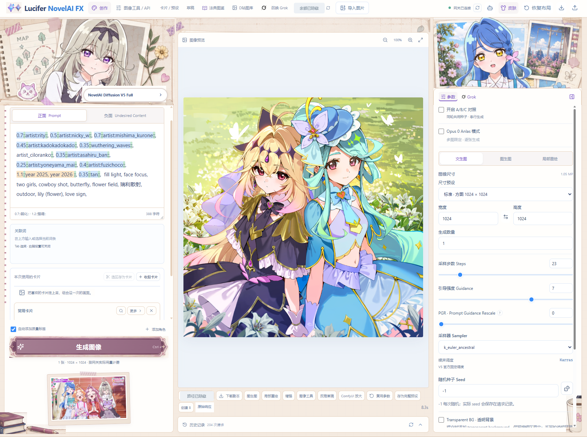
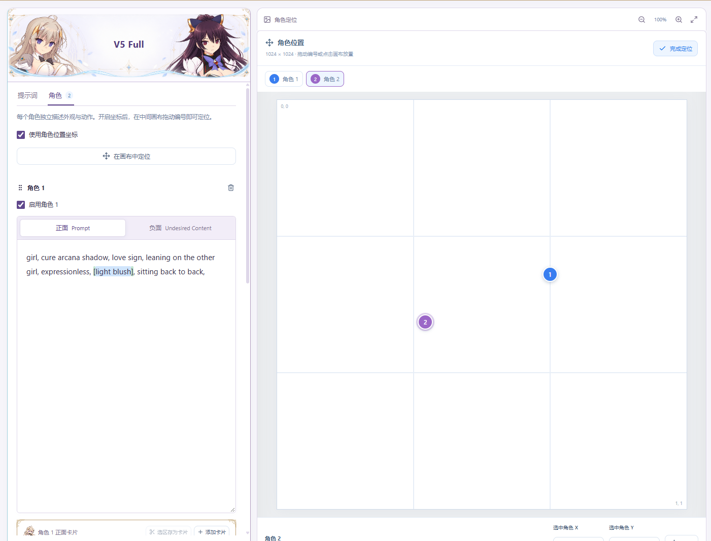
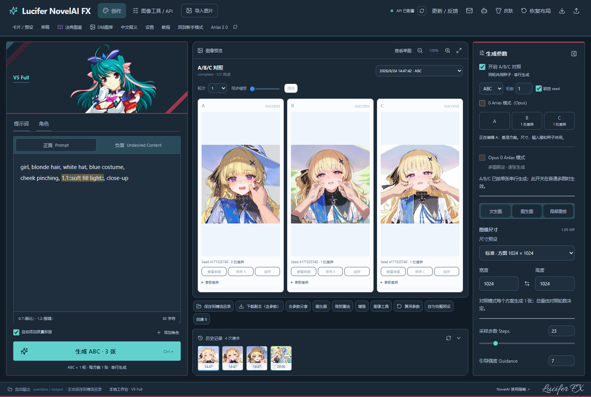
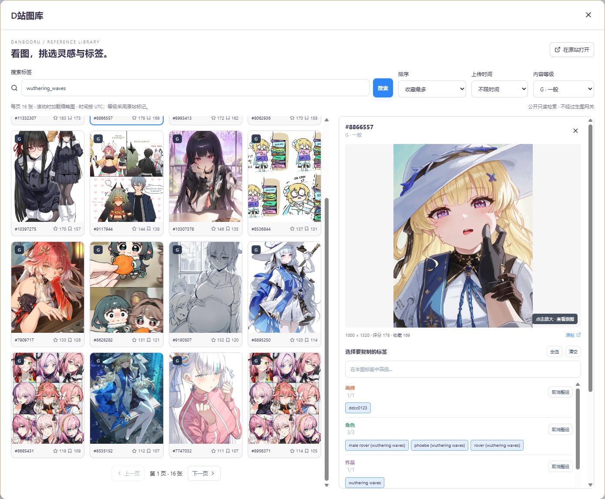
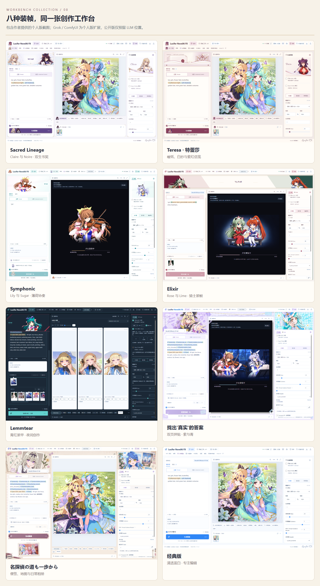
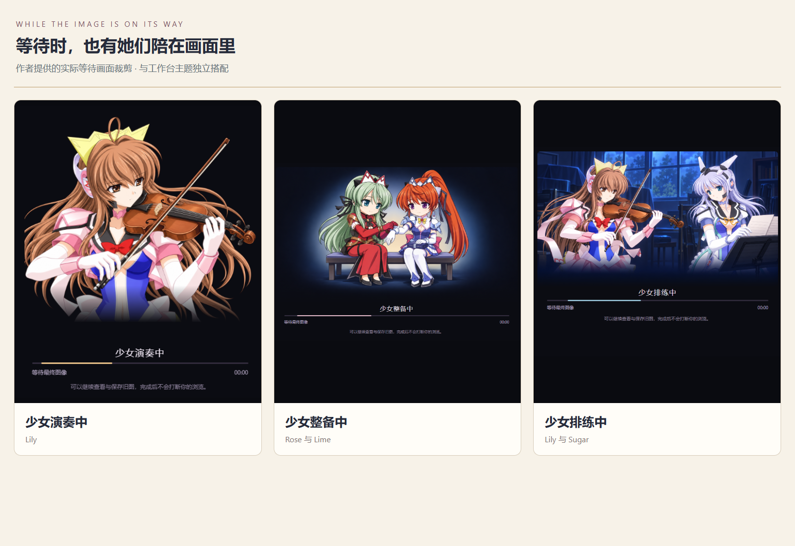

# Lucifer NovelAI FX

**面向 NovelAI Diffusion V5 Full 与 V4.5 Full / Curated 的 Windows 中文创作工作台。** 这是个人维护的非官方前端，与 NovelAI 官方没有隶属关系。它把长 Prompt、角色、参数、图片配方、对照实验与本地资料组织在同一个界面中；只有你明确点击生成，才会向自己配置的 NovelAI 官方接口或兼容网关提交生图请求。

[下载最新版](https://github.com/Lucifer-St/lucifer-novelai-fx/releases/latest) · [直接下载 v1.7.0 Windows x64](https://github.com/Lucifer-St/lucifer-novelai-fx/releases/download/v1.7.0/Lucifer-NovelAI-FX-Share-1.7.0-Windows-x64.zip) · [核对 SHA-256](https://github.com/Lucifer-St/lucifer-novelai-fx/releases/download/v1.7.0/SHA256SUMS-1.7.0.txt) · [报告 Bug](https://github.com/Lucifer-St/lucifer-novelai-fx/issues/new?template=bug_report.yml) · [提出改进](https://github.com/Lucifer-St/lucifer-novelai-fx/issues/new?template=feature_request.yml)

<p align="center">
  <a href="./assets/readme/v2/hero.webp"></a>
</p>

<p align="center">
  <a href="./assets/readme/v2/screens/overview.webp"></a>
</p>

> 本页优先使用作者提供的实际截图，已裁去个人路径与署名、遮盖余额和保存位置；Teresa、Sacred Lineage 与经典版展示沿用公开版截图。部分截图来自个人版，保留了 **Grok 图标与 ComfyUI 入口**：这些集成不随公开版提供，公开版目前仅预留可折叠的 LLM 扩展位置，尚未接入模型。截图中的自建卡片与预设也不代表随包内容。角色场景插画由 Triangle 素材工作区另行制作；未为截图重新提交 NovelAI 生图请求。

## 把分散步骤接成一条本机工作流

NovelAI 官网已经提供正负 Prompt、强调语法与高亮、标签建议、多角色与位置画布、图生图、History、Prompt Chunks 和图片参数回读。FX 使用相同的底层 NovelAI 模型与账户额度，把这些能力重新组织成适合长时间使用的中文本机工作台。

你可以继续整理越来越长的 Prompt，只取回旧图中真正需要的参数，公平比较多套方案，在批量请求中避免模糊失败后的重复提交，并把历史、资料和自己的 Agent 接进同一套工作流。官方能力可参考 [Prompt 与基础设置](https://docs.novelai.net/en/image/basics/)、[强调与弱化](https://docs.novelai.net/en/image/strengthening-weakening/) 和 [多角色 Prompt](https://docs.novelai.net/en/image/multiplecharacters/)。

| 创作环节 | NovelAI 官网已有 | FX 的实现重点 |
|---|---|---|
| 写 Prompt | 正负 Prompt、强调、高亮、标签建议 | 原生长文本编辑器、正负标签页、本地建议、卡片 / 预设 / 草稿分层 |
| 多角色与旧图 | 角色 Prompt、位置画布、图生图、参数回读 | 按画布比例定位；PNG/JPEG/WebP 逐组选取、append 与未知字段隔离 |
| 试验与批次 | seed、Varieties、Enhance、多图 | A/B/C 共 seed、差异覆盖、采用方案、串行与 stop-after-current |
| 连续工作 | 当前页面 History | 本地历史、任务接回、选择保持、布局与外观偏好持久化 |

<p align="center">
  <a href="./assets/readme/v2/section-workflow.svg"></a>
</p>

<p align="center">
  <a href="./assets/readme/v2/workflow.webp"></a>
</p>

## 一步步把 Prompt 变成可复用资料

正面 Prompt、负面 Prompt 与每个角色自己的正负 Prompt 都保留熟悉的输入、选区、Undo、中文输入法和键盘操作；权重高亮会把 `{}`、`[]` 和数值 `::` 的嵌套强弱直接画在文字上。标签建议来自随包本地 Danbooru 词表，不会为了补全把正在写的 Prompt 交给远程建议接口。

从一次编辑到长期资料，FX 分成三个层次：

1. **提示词卡**是一段可组合的画风、角色或场景词。插入后仍可继续改写，也可以只移除这张卡对应的文本；卡片可设置分类与本地封面。
2. **完整预设**保存正面、负面、角色与生成参数，用来恢复一整套配方。
3. **草稿**再保存输入图、蒙版和 A/B/C 差异，用来接回正在进行的工作；恢复草稿不会自动生图。

官网也有可分类、嵌套并跨设备保存的 [Prompt Chunks](https://docs.novelai.net/en/image/promptchunks/)。FX 的区别是把可移除卡片实例、完整预设和含图片的草稿放进本机资料库，而不是声称官网没有复用能力。

<p align="center">
  <a href="./assets/readme/v2/screens/cards.webp"></a>
</p>

图中包含作者自己的卡片；新安装只预置 Claire、Noire、Rena，其他卡片可自行创建或导入。

<details>
<summary>完整预设：把整套参数保存下来（作者示例）</summary>

<p align="center"><a href="./assets/readme/v2/screens/presets.webp"></a></p>

这是用户自建预设示例；新安装仅预置三张提示词卡，不附带这份完整预设。

</details>

## 多角色定位，与选择性图片导入

每个角色都可以分别编辑正面与负面 Prompt，并在按当前输出宽高比显示的画布上拖动位置。坐标会随角色设置一起进入配方，不必在固定方格和最终构图之间反复换算。

导入 PNG、JPEG 或 WebP 时，FX 会先显示解析来源与可用字段，再让你逐项选择 Prompt、负面 Prompt、角色、参数和 seed。你可以替换当前内容，也可以 append；图片没有的项目不会把现有编辑器清空，未识别或不安全直接应用的字段会被隔离保留。导入按钮只恢复所选内容，不会顺手触发生成。

官网已经支持多角色、位置画布、图生图，也能把保存的图片拖回页面恢复 Prompt 与参数；官方说明默认会带回 seed。FX 在此基础上强调“先看、再选、再导入”，让每次导入的范围清楚、可控。

<p align="center">
  <a href="./assets/readme/v2/screens/characters.webp"></a>
  <a href="./assets/readme/v2/screens/import.webp"></a>
</p>

常用创作控制保留文生图、图生图、局部重绘、PGR、采样与尺寸参数；高级生成设置和原始请求查看集中在图像工具 / API 工作台。部分工具能否使用仍取决于所配置服务的支持范围。

## A/B/C 对照、串行任务与本地历史

对照模式把 A 设为共同基准，B/C 只保存相对 A 的差异。每轮共用 seed，界面直接列出改了哪些字段；不满意可以恢复继承，满意可以采用某个方案继续编辑。这样比较的是明确变量，而不是凭记忆猜上一张用了什么参数。

历史先读取最近 200 条；展开历史区域后点击“加载更早记录”，即可继续访问磁盘中更早的创作记录。

多图任务会先固定本轮参数，再按单张串行提交。点击停止时，当前张完成后不再提交后续图片，已经完成的结果仍可查看和保存。请求回执不明确时，FX 会继续查询原任务，不创建新任务自动重试可能收费的生成。

普通生成和逐张批次可以在刷新后按原任务接回；你正在查看旧图时，新结果不会强行抢走当前选择。A/B/C 对照采取更保守的边界：离开或刷新页面会请求停止后续方案，当前已经开始的方案可能完成，未提交的方案不会在重开页面后自动继续；完成记录仍可查看。官网本身也有页面 History、seed 复用与参数回拖，但官方说明刷新或关闭页面后未下载图片会丢失；详见 [官方入门与 History 说明](https://docs.novelai.net/en/image/tutorial-imgintro/)。

<p align="center">
  <a href="./assets/readme/v2/screens/comparison.webp"></a>
</p>

<p align="center">
  <a href="./assets/readme/v2/section-gallery.svg"></a>
</p>

## 找灵感：D 站图库与法典图鉴

D 站（Danbooru）图库可以按标签、评分、排序和上传时间浏览；进入详情后，可以按 artist、character、copyright、general 等类别取舍标签，在 NovelAI 格式与原始 tag 之间切换，把选中内容存成本机卡片。原图只在你打开查看器后读取，可缩放、拖动，也能作为真实图片文件拖回导入区。

中文释义提供本地词典与自定义词条；未知词保留原文，外部翻译由你主动复制并打开网页。

法典图鉴以独立 Atlas 打开，自己的主题、密度与深色设置保存到独立存储。图库和图鉴都是资料辅助：浏览不会自动变成生成请求，也不代表来源图片自动取得再分发许可。

<p align="center">
  <a href="./assets/readme/v2/screens/gallery.webp"></a>
</p>

<p align="center">
  <a href="./assets/readme/v2/theme-archive.webp"></a>
</p>

## 8 套工作台主题，9 张独立等待插画

主题改变工作台的装帧、角色装饰与信息层级，不改变 Prompt、参数、历史或生成请求。三栏宽度可以拖动调整并保存；收起参数栏或切换窄屏时，主题立绘按原始比例重新排布。

| 工作台主题 | 视觉方向 |
|---|---|
| 经典版 | 清透蓝白 · 专注创作 |
| Teresa · 特蕾莎 | 暖纸私笺 · 皇冠蜡封 |
| Sacred Lineage | 双生书契 · Claire 书签 |
| Symphonic | Lily & Sugar · 薄荷协奏 |
| Elixir | Rose & Lime · 骑士装帧 |
| Lemmtear | 青红装甲 · 夜间创作 |
| 找出‘真实’的答案 | Arcana Shadow & Eclair · 双页拼贴 |
| 名探偵の道も一歩から | るるか & くれあ · 日常相册 |

<p align="center">
  <a href="./assets/readme/v2/screens/themes.webp"></a>
</p>

<details>
<summary>查看各主题完整截图</summary>

[Teresa · 特蕾莎](./assets/readme/v2/screens/skin-teresa.webp) · [Sacred Lineage](./assets/readme/v2/screens/skin-book-contract.webp) · [Symphonic](./assets/readme/v2/screens/skin-symphonic.webp) · [Elixir](./assets/readme/v2/screens/skin-elixir.webp) · [Lemmtear](./assets/readme/v2/screens/skin-lemmtear.webp) · [找出‘真实’的答案](./assets/readme/v2/screens/skin-precure-scrapbook.webp) · [名探偵の道も一歩から](./assets/readme/v2/screens/skin-precure-days.webp) · [经典版](./assets/readme/v2/screens/skin-classic.webp)

</details>

等待画面与工作台主题是两套独立选择。当前有 **9 张插画等待图**，另有简洁状态图和随机模式；随机图只在提交任务时选一次，不会在同一任务等待过程中跳来跳去。新安装附带的 **Claire、Noire、Rena 三张内容是提示词卡**，不是三套完整预设，也不是等待插画数量。

<p align="center">
  <a href="./assets/readme/v2/screens/waiting.webp"></a>
</p>

图为 9 张等待插画中的 3 张示例。

## 更新说明

### [v1.7.0](https://github.com/Lucifer-St/lucifer-novelai-fx/releases/tag/v1.7.0) · 2026-09-26

- **D 站保留浏览现场**：关闭再打开保持当前页、筛选、滚动、选图和标签选择，不因缓存到期重新检索。隐藏时停止图片读取；右上角刷新会重新读取当前页。
- **直接跳页**：输入 1–1000 的页码并回车跳转，保持当前每页张数。
- **现代文件夹选择器**：带地址栏、磁盘导航与新建文件夹，可直接粘贴路径；取消不会改变设置。选择后点击“检查目录并保存”。
- **文件夹快捷按钮**：打开已保存的输出／精选目录，或在资源管理器中选中当前图片。
- **两款名侦探皮肤**：扩大主提示词编辑区，左栏整体滚动，保留插画比例和手动尺寸调整。

已验证发布过的 1.6.0 程序能用原有更新器升级到本版，并保留数据、在原端口重启。目录切换与生成／保存互斥；旧图片不会被搬动。1.5.1 及更早版本仍需先手动升级。

### [v1.6.0](https://github.com/Lucifer-St/lucifer-novelai-fx/releases/tag/v1.6.0) · 2026-09-25

- **D 站不限时间排行**：修复热门评分／收藏排序的大范围查询超时，保留筛选条件、精确排序和分页；不会偷偷改成近一周或截断低分结果。
- **角色框自适应**：正负面输入框随内容伸缩，保留手动调整、Undo、输入法和权重高亮。
- **官方预设**：按模型提供正面 Standard／Light 和适用的负面 Heavy／Light／Human Focus／Furry Focus，保留自写词；配方和图片参数回读保持一致。预设依据 [官方质量标签](https://docs.novelai.net/en/image/qualitytags/) 与 [官方负面预设](https://docs.novelai.net/en/image/undesiredcontent/)。
- **图片恢复与网络提示**：缩略图、预览和原图支持手动重新加载；法典图鉴显示连接超时、DNS、TLS 等具体错误。未把外部服务异常一概标为生图离线，也不会自动重试可能计费的生成。
- **应用内升级**：启动后检查 GitHub 稳定版，可关闭；点击下载、SHA-256 校验后安装并重启。生成期间拒绝安装，保留数据与旧版备份，失败可回滚，意外中断可恢复。

1.5.1 及更早版本需先手动升级到本版，之后才能使用应用内安装。此次修复验证了本地错误恢复与公开素材读取；反馈中的偶发生成掉图仍需结合具体网络／上游状态诊断，不能保证外部服务不再中断。

### [v1.5.1](https://github.com/Lucifer-St/lucifer-novelai-fx/releases/tag/v1.5.1) · 2026-09-25

- **全皮肤模型切换**：修复非经典皮肤隐藏模型入口的问题；统一使用紧凑下拉框，直接选择 V5 Full、V4.5 Full 或 V4.5 Curated。
- **模型显示一致**：装饰横幅改用通用品牌文字，切换模型后不再残留固定的 V5 标题；提示词和已保存的选择继续保留。
- **更新说明配图**：采用独立人物素材，标题统一为“更新说明”。

### [v1.5.0](https://github.com/Lucifer-St/lucifer-novelai-fx/releases/tag/v1.5.0) · 2026-09-25

- **V4.5 Full / Curated**：新增模型支持；Precise Reference 与 Vibe Transfer 仅在 V4.5 中开放，互斥且可明确关闭。参考图草稿按模型保存，图生图也能明确退出。
- **中文标签建议**：输入中文可查询本地英文候选，支持个人词条和词典导入；选择候选才修改提示词，查询不调用付费接口。
- **V5 画面文字**：可单独填写文字，或选择提取引号内容；组装并预览最终 `Text:`，不改写编辑区原文。
- **生成图库**：按提示词、标签、seed、日期与模型搜索，支持收藏、手工标签、任意两图比较、参数回填、批量导出及收藏／标签备份。
- **参考图费用与恢复**：Vibe 编码与生图分开操作；编码结果可复用，任务状态不明确时查询原记录，不自动重复提交。
- **法典社区图包**：修复 NovelAI V5／V4.5 社区精选图包打不开、反复刷新仍失败的问题。
- **逐张任务停止**：分开提供“停止后续图片”和“立即停止接收”，保留已完成图片；停止本地接收不保证上游取消或免于计费。

### [v1.4.1](https://github.com/Lucifer-St/lucifer-novelai-fx/releases/tag/v1.4.1) · 2026-09-24

- **安全退出与升级**：设置中增加退出后台入口；有生成、对照或写入任务时会阻止退出。启动器检查安装身份及运行版本，避免新旧版本混用。
- **备份先预览**：显示新增、跳过和冲突，重复导入相同资料不会增加副本；可合并、恢复或只恢复界面偏好，本地冲突内容继续保留。
- **历史分页**：可以继续加载 200 条以前的记录；CLI 支持使用游标读取更早历史。

### [v1.4.0](https://github.com/Lucifer-St/lucifer-novelai-fx/releases/tag/v1.4.0) · 2026-09-24

- **Teresa · 特蕾莎主题**：加入独立的暖纸、紫红与细金边主题，包含立绘、收栏和窄屏布局；Sacred Lineage 与已有皮肤选择保留。
- **八主题与独立加载画面**：分享版可选八款工作台主题，九张插画加载画面仍独立选择，不改变生成参数。
- **产品页与功能展示**：补充卡片、预设、角色定位、选择性导入、A/B/C、任务恢复及本地资料整理的介绍，并展示主题和实际界面。

### [v1.3.0](https://github.com/Lucifer-St/lucifer-novelai-fx/releases/tag/v1.3.0) · 2026-09-24

- **首个公开 Windows 版本**：便携包自带 Node.js，支持用户自己的 NovelAI 官方接口或兼容网关。
- **基础创作流程**：提供正负面与多角色提示词、常用参数、本地标签、卡片、完整预设、草稿、图片参数导入、A/B/C 对照、逐张多图、历史和 Anlas 估算。
- **Agent 入口**：内置可选 CLI／MCP；普通使用不依赖 Agent，参数计划不会自动生图。
- **更新与反馈**：手动检查 GitHub 版本；反馈先在本机预览，再由用户自行提交，不自动上传。
- **初始素材**：仅预置 Claire、Noire、Rena 三张提示词卡，不预置完整预设；升级时保留用户自建及无法明确识别的内容。

以上为 Windows 更新记录；Android 仍封存在 v1.1.1，Wildcards 本轮未改动。真实生成和兼容网关的计费以对应服务为准。

<p align="center">
  
</p>

<p align="center">
  <a href="./assets/readme/v2/section-local-tools.svg"></a>
</p>

## 本机数据、费用与联网边界

- 使用者自备 NovelAI 账号与 Token，或使用已自行确认兼容性、计费和隐私条款的兼容网关。分享包不附带作者凭据或私人服务。
- Windows 凭据由当前账户的 DPAPI 保护；图片、历史、卡片、预设、草稿和连接设置默认保存在便携目录的 `userdata`。主题、三栏宽度等界面选择保存在应用的浏览器本地存储中。
- 工具备份为 JSON，包含卡片、完整预设、非秘密连接设置、新手模式、已列入导出的界面选择，以及生成图库收藏、标签和标注；不包含 API key、图片、历史、账本或创作草稿。参考图草稿保存在浏览器来源对应的 IndexedDB，JSON 备份不包含这些浏览器数据。完整迁移请备份整个 `userdata`、相关浏览器数据和自选图片目录；SQLite 派生索引可重建，图片标注与参考图编码记录则保存在 `userdata` 中。去参数分享会另存副本；它不能代替作品授权判断。
- Anlas 面板区分条件估算、手动官网校准、账户回读和未知消费。Opus 的 0 Anlas 有账户、额度、尺寸、步数、单张和无 base image 等条件；V5 还有可恢复 usage limit，因此这不是“免费承诺”。当前规则以 [NovelAI FAQ](https://docs.novelai.net/en/faq/) 为准。
- 启动时应用会读取可用模型：官方连接使用随包模型定义；已配置 OpenAI-compatible 网关时，可能向该服务的模型列表做只读检查。主动连接检查和生成访问用户配置的服务；打开 D 站图库或法典图鉴会访问相应公开数据与图片；外部翻译只复制文字并打开由用户操作的网页；更新检查只在点击后访问 GitHub。

<details>
<summary><strong>CLI、MCP 与 Agent</strong></summary>

Windows 包内的 `fx.cmd` 使用自带 Node.js，提供 21 项 CLI 命令；MCP 提供 14 个工具，可读取状态、冻结计划、查询任务、管理资料库和保存结果。`plan` 离线，不会生成图片；只有用户明确要求后执行 `generate` 才可能产生费用。回执不明确时查询同一任务 ID，不自动重试。

```powershell
fx.cmd status
fx.cmd plan --prompt "a quiet lake" --seed 42 --out plan.json
fx.cmd generate --plan plan.json --wait
```

Agent 使用同一份本机设置，但配置不包含 API key。普通桌面使用不依赖 Agent，也不要求另装 Node 或 Python。

</details>

## Windows 安装与升级

支持 Windows 10/11 x64。下载 ZIP 后用同一 Release 中的 `SHA256SUMS-1.7.0.txt` 核对哈希，完整解压到普通可写目录，再双击 `启动 Lucifer FX.exe`。不要直接在 ZIP 预览中运行。首次进入后填写自己的连接，先做只读检查，再从单张、普通尺寸和较低步数开始。想使用完整的角色、对照与高级参数控制时，点击“展开完整功能”。完整步骤、文件位置与回退方法见 [Windows 安装、升级与隐私说明](./docs/WINDOWS.md)。

从 1.6.0 起，可在“更新 / 反馈”完成下载、校验、安装与重启；生成期间不会安装。启动后的版本检查可关闭，下载和安装都需要主动点击。1.5.1 及更早版本先按 [升级步骤](./docs/WINDOWS.md#升级与回退) 退出服务、备份并手动升级；始终保留原位 `userdata`。

公开版覆盖 V5 Full 与 V4.5 Full / Curated 工作流；Precise Reference 与 Vibe Transfer 仅用于 V4.5。个人版的 Grok / ComfyUI 集成不随公开版提供。

本轮只发布 Windows x64；Android 版仍封存在 `v1.1.1`，不随 `v1.7.0` 发布。

## 反馈、安全与公开范围

普通问题使用 [Bug 表单](https://github.com/Lucifer-St/lucifer-novelai-fx/issues/new?template=bug_report.yml)，想法使用 [改进建议表单](https://github.com/Lucifer-St/lucifer-novelai-fx/issues/new?template=feature_request.yml)。应用只在本机生成反馈预览，不会替你提交。API key、Token、Cookie、私有 Prompt、本机路径、原始日志、图片、用户数据和上游响应正文不得粘贴到公开 Issue；安全漏洞请使用 [GitHub 私密漏洞报告](https://github.com/Lucifer-St/lucifer-novelai-fx/security/advisories/new)，详见 [安全报告说明](./SECURITY.md)。

本公开仓库只保存说明、截图、Issue 模板与 Windows Release，不公开开发源码。便携包包含运行所需的编译后 JavaScript 等资源；这不等于公开开发源码仓库，也不表示运行文件不可查看。GitHub 自动生成的 Source code（zip / tar.gz）只含本仓库文档与素材，不是可运行应用。

应用及截图中可能出现第三方名称、商标、角色或美术素材，相关权利归各自权利人。程序依赖的许可证文本随 Windows 下载包提供。
