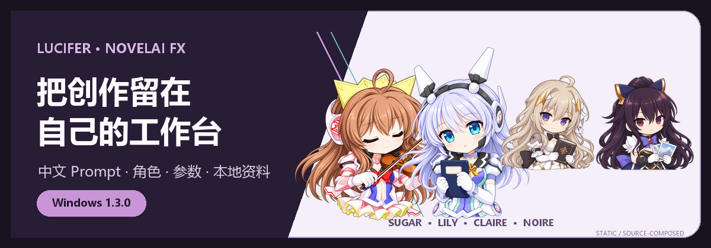
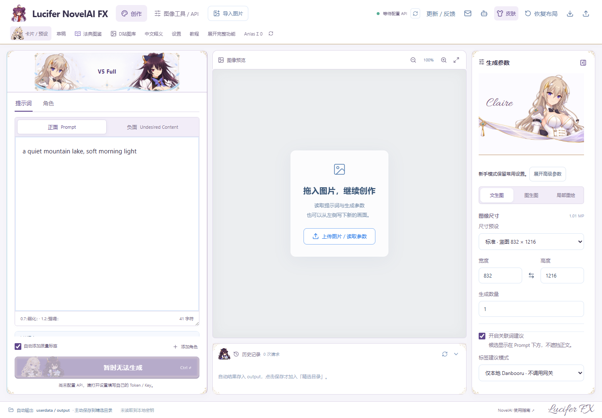

  

# Lucifer NovelAI FX

一套面向 Windows 的中文 NovelAI 创作工作台：整理 Prompt、角色和参数，在你明确点击后才向自己配置的 NovelAI 官方接口或兼容网关提交生图请求。下载包不提供账号、Token、私有网关或开发者服务。

**`v1.3.0` 是首个公开 Windows x64 版本。** 下载包自带 Node.js 运行环境，不要求另装 Node、Python、Agent 或 ComfyUI。

[下载最新版](https://github.com/Lucifer-St/lucifer-novelai-fx/releases/latest) · [直接下载 v1.3.0 Windows x64 ZIP](https://github.com/Lucifer-St/lucifer-novelai-fx/releases/download/v1.3.0/Lucifer-NovelAI-FX-Share-1.3.0-Windows-x64.zip) · [安装与升级说明](./docs/WINDOWS.md)

## 真实界面

  

截图来自本地发行候选的真实渲染，使用空历史、未配置凭据与中性示例 Prompt；它不代表真实付费生成结果。

## 你可以做什么

- 用中文界面编辑正向、负向和多角色 Prompt，保留 NovelAI 常用参数与 PGR。
- 从 Danbooru 标签快照查词，在本机保存自己的提示词卡、完整预设和草稿。
- 导入图片与参数，进行 A/B/C 对照、逐张多图与批次管理；失败或中断不会自动重复提交付费请求。
- 在本机保存生成历史、精选图片和 Anlas 估算；官方只读连接检查不会生图。
- 通过可选的 MCP/CLI 入口连接用户自己的 Agent；普通桌面使用不依赖 Agent。
- 主动检查 GitHub 上的新版本，并手动决定是否下载和升级。应用不会自动下载或安装更新。

## 快速开始

1. 从 [GitHub Releases](https://github.com/Lucifer-St/lucifer-novelai-fx/releases/latest) 下载 Windows ZIP，并用 [SHA256SUMS-1.3.0.txt](https://github.com/Lucifer-St/lucifer-novelai-fx/releases/download/v1.3.0/SHA256SUMS-1.3.0.txt) 核对文件。
2. 完整解压到普通可写目录，不要直接在 ZIP 预览中运行。
3. 双击 `启动 Lucifer FX.exe`。
4. 在设置中选择 NovelAI 官方接口或兼容协议，填写自己的凭据，先执行只读连接检查。
5. 从普通尺寸、较低步数的图片开始，核对费用提示后再主动点击生成。

升级前请退出旧服务并备份整个 `userdata`。不要用新 ZIP 覆盖唯一一份用户数据。完整步骤见 [Windows 安装、升级与隐私说明](./docs/WINDOWS.md)。

## 数据、费用与隐私

- Windows 凭据由当前用户的 DPAPI 保护；输出、历史与自建资料默认保存在便携目录的 `userdata`。
- 应用不会自动上传反馈、Prompt、图片、日志或备份。Issue 内容由用户预览、检查并手动提交。
- Anlas、Opus 和兼容网关计费信息可能存在未知回执。界面估算不是官方账单，也不保证某次请求免费。
- 去参数导出会创建新副本；它只能减少图像中已知元数据与像素隐写，不能证明图片可公开分发。
- 项目是独立客户端，并非 NovelAI 官方应用。

## 反馈与安全

- 可复现的问题：[提交 Bug](https://github.com/Lucifer-St/lucifer-novelai-fx/issues/new?template=bug_report.yml)
- 功能与体验建议：[提交改进建议](https://github.com/Lucifer-St/lucifer-novelai-fx/issues/new?template=feature_request.yml)
- 安全漏洞或敏感证据：[私密报告安全漏洞](https://github.com/Lucifer-St/lucifer-novelai-fx/security/advisories/new)

请勿在公开 Issue 中粘贴 API key、Cookie、私有 Prompt、本机路径、原始日志或上游响应正文。详见 [安全报告说明](./SECURITY.md)。

## 发布范围

本仓库用于公开说明、截图和 Windows Release 下载，不包含应用的开发源码。Windows 便携包包含运行所需的编译后 JavaScript 等资源；这不等于公开开发源码仓库，也不表示运行文件不可查看。GitHub 自动生成的 “Source code” ZIP/TAR 只包含本仓库中的公开文档与素材，不是应用源码，也不能运行应用。

本轮只发布 Windows 10/11 x64 便携包；Android 不在本次公开发布范围内。

应用及截图中可能出现第三方名称、商标、角色或美术素材，相关权利归各自权利人。纳入本次发布不构成对归属或授权范围的额外声明。程序依赖的许可证文本随 Windows 下载包提供。
